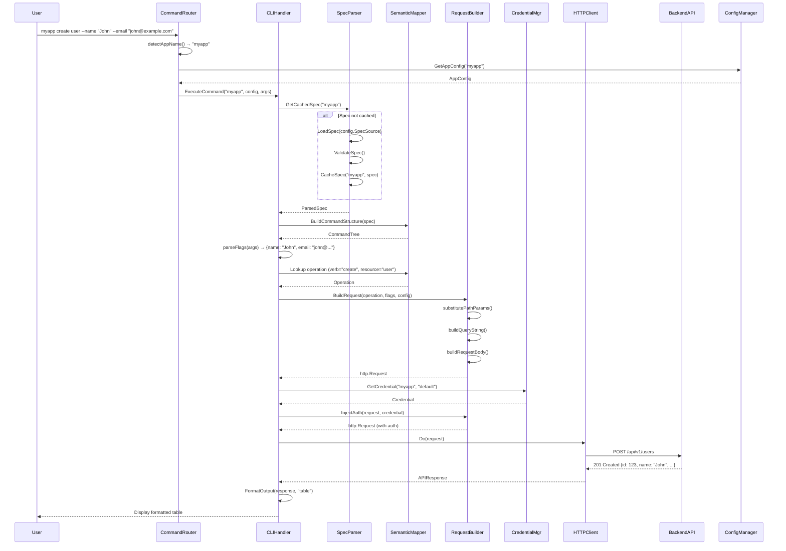
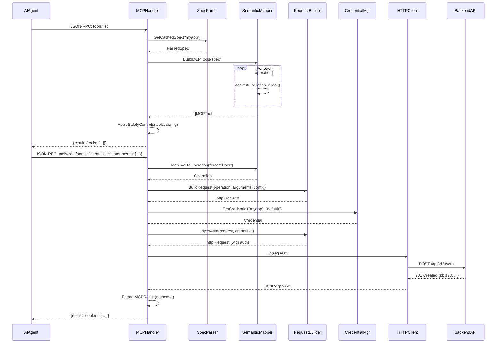

# Design Document: OpenBridge

## Overview

OpenBridge is a universal API runtime engine that bridges the gap between OpenAPI specifications and two distinct interfaces: a semantic CLI for human users and an MCP server for AI agents. The system is built around a zero-code-generation philosophy where all behavior is dynamically driven by parsing OpenAPI specifications at runtime.

### Core Design Principles

1. **Runtime Interpretation**: Parse and interpret OpenAPI specs at runtime rather than generating code
2. **Single Binary Distribution**: All functionality packaged in one executable with no external dependencies
3. **Performance First**: Cold start under 100ms through efficient caching and lazy loading
4. **Security by Default**: Credentials stored in system keyring, never in plain text
5. **Human-Friendly CLI**: kubectl-style semantic commands with verb-resource patterns
6. **AI-Native Integration**: First-class MCP protocol support for seamless AI agent interaction

### Technology Stack

**Language**: Go (Golang)
- Excellent performance characteristics (cold start < 100ms)
- Single binary compilation with no runtime dependencies
- Strong standard library for HTTP, JSON, and system integration
- Mature ecosystem for OpenAPI parsing and CLI frameworks

**Key Libraries**:
- OpenAPI parsing: `kin-openapi/openapi3` for OpenAPI 3.x, with conversion layer for OpenAPI 2.0
- CLI framework: `spf13/cobra` for command structure and `spf13/pflag` for flag parsing
- Keyring integration: `99designs/keyring` for cross-platform credential storage
- JSON-RPC: Custom implementation for MCP protocol
- Output formatting: `olekukonko/tablewriter` for table output

## Architecture

### High-Level Architecture

```
┌─────────────────────────────────────────────────────────────┐
│                        User Layer                            │
│  ┌──────────────────┐              ┌──────────────────────┐ │
│  │  Human Terminal  │              │   AI Agent (Claude)  │ │
│  │   (CLI Commands) │              │   (MCP Client)       │ │
│  └────────┬─────────┘              └──────────┬───────────┘ │
└───────────┼────────────────────────────────────┼─────────────┘
            │                                    │
            │ <app> <verb> <resource> [flags]    │ JSON-RPC
            │                                    │ (MCP Protocol)
            ▼                                    ▼
┌─────────────────────────────────────────────────────────────┐
│                    OpenBridge Core                           │
│  ┌──────────────────────────────────────────────────────┐   │
│  │              Command Router                          │   │
│  │  ┌────────────────┐         ┌──────────────────┐    │   │
│  │  │ CLI Handler    │         │  MCP Handler     │    │   │
│  │  │ (Semantic CLI) │         │  (JSON-RPC)      │    │   │
│  │  └───────┬────────┘         └────────┬─────────┘    │   │
│  └──────────┼──────────────────────────┼───────────────┘   │
│             │                           │                   │
│             └───────────┬───────────────┘                   │
│                         ▼                                   │
│  ┌──────────────────────────────────────────────────────┐   │
│  │           OpenAPI Interpreter Engine                 │   │
│  │  ┌────────────────────────────────────────────────┐  │   │
│  │  │  Spec Parser & Validator                       │  │   │
│  │  │  - OpenAPI 2.0/3.0/3.1 support                │  │   │
│  │  │  - Schema validation                           │  │   │
│  │  │  - Spec caching                                │  │   │
│  │  └────────────────────────────────────────────────┘  │   │
│  │  ┌────────────────────────────────────────────────┐  │   │
│  │  │  Semantic Mapper                               │  │   │
│  │  │  - Resource extraction from paths              │  │   │
│  │  │  - HTTP method → verb mapping                  │  │   │
│  │  │  - x-cli-* extension handling                  │  │   │
│  │  └────────────────────────────────────────────────┘  │   │
│  │  ┌────────────────────────────────────────────────┐  │   │
│  │  │  Request Builder                               │  │   │
│  │  │  - Parameter mapping                           │  │   │
│  │  │  - Request body construction                   │  │   │
│  │  │  - Authentication injection                    │  │   │
│  │  └────────────────────────────────────────────────┘  │   │
│  └──────────────────────────────────────────────────────┘   │
│                         │                                   │
│  ┌──────────────────────┼───────────────────────────────┐   │
│  │  Configuration Manager                              │   │
│  │  - App registry                                     │   │
│  │  - Profile management                               │   │
│  │  - Config import/export                             │   │
│  └─────────────────────────────────────────────────────┘   │
│                         │                                   │
│  ┌──────────────────────┼───────────────────────────────┐   │
│  │  Credential Manager                                  │   │
│  │  - Keyring integration (OS-specific)                │   │
│  │  - Token retrieval & injection                      │   │
│  └─────────────────────────────────────────────────────┘   │
└───────────────────────┼─────────────────────────────────────┘
                        │ HTTP/HTTPS
                        ▼
┌─────────────────────────────────────────────────────────────┐
│                   Backend API Services                       │
│  (Any REST API with OpenAPI specification)                  │
└─────────────────────────────────────────────────────────────┘
```

### Detailed Class Diagram

```mermaid
classDiagram
    class CommandRouter {
        -cliHandler CLIHandler
        -mcpHandler MCPHandler
        -configMgr ConfigManager
        +Execute(args []string) error
        +IsMCPMode(args []string) bool
        -detectAppName(args []string) string
        -handleOBCommand(args []string) error
    }

    class CLIHandler {
        -specParser SpecParser
        -semanticMapper SemanticMapper
        -requestBuilder RequestBuilder
        -credentialMgr CredentialManager
        -httpClient http.Client
        +ExecuteCommand(appName string, config AppConfig, args []string) error
        +GenerateCompletion(shell string) string
        +FormatOutput(response APIResponse, format string) string
        -parseFlags(args []string) map[string]any
        -resolveParameterLocation(param Parameter, flags map[string]any)
        -constructBodyFromFlags(flags map[string]any, schema Schema) any
    }

    class MCPHandler {
        -specParser SpecParser
        -semanticMapper SemanticMapper
        -requestBuilder RequestBuilder
        -credentialMgr CredentialManager
        -httpClient http.Client
        +StartServer(config AppConfig) error
        +HandleListTools(request MCPRequest) MCPResponse
        +HandleCallTool(request MCPRequest) MCPResponse
        +ApplySafetyControls(tools []MCPTool, config SafetyConfig) []MCPTool
        -convertOperationToTool(operation Operation) MCPTool
    }

    class SpecParser {
        -cache map[string]ParsedSpec
        -cacheTTL time.Duration
        +LoadSpec(source string) ParsedSpec
        +ValidateSpec(spec ParsedSpec) error
        +GetCachedSpec(appName string) ParsedSpec
        +CacheSpec(appName string, spec ParsedSpec)
        -loadFromFile(path string) ParsedSpec
        -loadFromURL(url string) ParsedSpec
        -normalizeV2ToV3(spec ParsedSpec) ParsedSpec
    }

    class SemanticMapper {
        +ExtractResource(path string) string
        +MapVerb(method string, path string, operation Operation) string
        +BuildCommandStructure(spec ParsedSpec) CommandTree
        +BuildMCPTools(spec ParsedSpec) []MCPTool
        -applyOverrides(operation Operation) string
        -resolveConflicts(resources map[string]Resource)
    }

    class RequestBuilder {
        +BuildRequest(operation Operation, params map[string]any, config AppConfig) http.Request
        +InjectAuth(request http.Request, authConfig AuthConfig) error
        +ValidateParams(params map[string]any, operation Operation) error
        -substitutePathParams(path string, params map[string]any) string
        -buildQueryString(params map[string]any) string
        -buildRequestBody(params map[string]any, schema Schema) []byte
    }

    class ConfigManager {
        -configDir string
        +InstallApp(name string, specSource string, config InstallConfig) error
        +UninstallApp(name string) error
        +GetAppConfig(name string) AppConfig
        +ListApps() []string
        +ExportProfile(appName string, profileName string) []byte
        +ImportProfile(appName string, data []byte) error
        +CreateShim(appName string) error
        -loadConfig(path string) AppConfig
        -saveConfig(path string, config AppConfig) error
    }

    class CredentialManager {
        -keyring Keyring
        +StoreCredential(appName string, profileName string, credential Credential) error
        +GetCredential(appName string, profileName string) Credential
        +DeleteCredential(appName string, profileName string) error
        +ListCredentials(appName string) []string
        -buildKeyringKey(appName string, profileName string) string
    }

    class ParsedSpec {
        +Version string
        +Info SpecInfo
        +Servers []Server
        +Paths map[string]PathItem
        +Components Components
    }

    class Operation {
        +Method string
        +Path string
        +OperationID string
        +Summary string
        +Description string
        +Parameters []Parameter
        +RequestBody RequestBody
        +Responses map[string]Response
    }

    class AppConfig {
        +Name string
        +SpecSource string
        +Profiles map[string]Profile
        +DefaultProfile string
    }

    class Profile {
        +Name string
        +BaseURL string
        +Auth AuthConfig
        +Headers map[string]string
        +TLSConfig TLSConfig
        +SafetyConfig SafetyConfig
    }

    CommandRouter --> CLIHandler
    CommandRouter --> MCPHandler
    CommandRouter --> ConfigManager
    CLIHandler --> SpecParser
    CLIHandler --> SemanticMapper
    CLIHandler --> RequestBuilder
    CLIHandler --> CredentialManager
    MCPHandler --> SpecParser
    MCPHandler --> SemanticMapper
    MCPHandler --> RequestBuilder
    MCPHandler --> CredentialManager
    SpecParser --> ParsedSpec
    SemanticMapper --> ParsedSpec
    SemanticMapper --> Operation
    RequestBuilder --> Operation
    ConfigManager --> AppConfig
    AppConfig --> Profile
```



### CLI Command Execution Sequence Diagram



### MCP Tool Invocation Sequence Diagram



### Component Interaction Flow

**CLI Command Execution Flow**:
1. User executes: `myapp create user --name "John" --email "john@example.com"`
2. CLI Handler parses command structure (verb=create, resource=user, flags)
3. Semantic Mapper looks up operation in cached OpenAPI spec
4. Request Builder constructs HTTP request with parameters
5. Credential Manager injects authentication from keyring
6. HTTP client executes request to backend API
7. Response formatter displays result as table/JSON/YAML

**MCP Tool Invocation Flow**:
1. AI agent sends `list_tools` JSON-RPC request
2. MCP Handler loads OpenAPI spec and converts operations to tools
3. Returns tool list with names, descriptions, and input schemas
4. AI agent sends `call_tool` request with tool name and arguments
5. MCP Handler maps tool to operation and constructs HTTP request
6. Executes API call and returns result in MCP format

## Components and Interfaces

### 1. Command Router

**Responsibility**: Entry point that determines execution mode (CLI vs MCP) and routes to appropriate handler.

**Interface**:
```go
type CommandRouter interface {
    // Execute determines mode and routes to appropriate handler
    Execute(args []string) error
    
    // IsMCPMode checks if running in MCP server mode
    IsMCPMode(args []string) bool
}

type commandRouter struct {
    cliHandler *CLIHandler
    mcpHandler *MCPHandler
    configMgr  *ConfigManager
}
```

**Implementation Details**:

The CommandRouter is the main entry point for the `ob` binary. It follows this decision tree:

1. **Parse Global Context**:
   - Check if invoked as `ob` or as an app shim (e.g., `myapp`)
   - Extract app name from invocation path or first argument
   - Parse global flags: `--version`, `--help`, `--profile`, `--mcp`

2. **Mode Detection**:
   ```go
   func (r *commandRouter) Execute(args []string) error {
       // Detect invocation mode
       appName := r.detectAppName(args)
       
       // Handle ob-level commands
       if appName == "ob" {
           return r.handleOBCommand(args) // install, uninstall, list, etc.
       }
       
       // Load app configuration
       config, err := r.configMgr.GetAppConfig(appName)
       if err != nil {
           return fmt.Errorf("app not found: %s", appName)
       }
       
       // Check for MCP mode
       if r.IsMCPMode(args) {
           return r.mcpHandler.StartServer(config)
       }
       
       // Default to CLI mode
       return r.cliHandler.ExecuteCommand(appName, config, args)
   }
   ```

3. **App Name Detection**:
   - If binary name is `ob`: first arg is app name or ob command
   - If binary name is anything else: binary name is app name (shim mode)
   - Example: `/usr/local/bin/myapp create user` → app name is "myapp"

4. **OB-Level Commands**:
   - `ob install <app-name> --spec <path>`: Install new app
   - `ob uninstall <app-name>`: Remove app
   - `ob list`: List installed apps
   - `ob version`: Show version
   - `ob help`: Show help

**Key Behaviors**:
- Detects `--mcp` flag to enter MCP server mode
- Routes CLI commands to CLI Handler
- Routes MCP requests to MCP Handler
- Handles global flags (--version, --help, --profile)
- Provides helpful error messages for unknown apps

### 2. OpenAPI Spec Parser

**Responsibility**: Load, parse, validate, and cache OpenAPI specifications.

**Interface**:
```go
type SpecParser interface {
    // LoadSpec loads from file path or URL
    LoadSpec(source string) (*ParsedSpec, error)
    
    // ValidateSpec validates against OpenAPI standards
    ValidateSpec(spec *ParsedSpec) error
    
    // GetCachedSpec retrieves cached parsed spec
    GetCachedSpec(appName string) (*ParsedSpec, bool)
    
    // CacheSpec stores parsed spec for reuse
    CacheSpec(appName string, spec *ParsedSpec) error
}

type ParsedSpec struct {
    Version    string // "2.0", "3.0", "3.1"
    Info       SpecInfo
    Servers    []Server
    Paths      map[string]PathItem
    Components Components
}
```

**Key Behaviors**:
- Supports OpenAPI 2.0 (Swagger), 3.0, and 3.1
- Converts OpenAPI 2.0 to 3.x internal representation
- Caches parsed specs in memory with TTL
- Validates spec structure and required fields
- Handles remote spec fetching with timeout and retry

### 3. Semantic Mapper

**Responsibility**: Map OpenAPI operations to semantic CLI commands and MCP tools.

**Interface**:
```go
type SemanticMapper interface {
    // ExtractResource extracts resource name from path
    ExtractResource(path string) string
    
    // MapVerb maps HTTP method to semantic verb
    MapVerb(method string, path string, operation *Operation) string
    
    // BuildCommandStructure creates CLI command tree
    BuildCommandStructure(spec *ParsedSpec) *CommandTree
    
    // BuildMCPTools converts operations to MCP tool definitions
    BuildMCPTools(spec *ParsedSpec) []MCPTool
}

type CommandTree struct {
    Resources map[string]*Resource
}

type Resource struct {
    Name       string
    Operations map[string]*Operation // verb -> operation
}

type Operation struct {
    Method      string
    Path        string
    OperationID string
    Summary     string
    Description string
    Parameters  []Parameter
    RequestBody *RequestBody
    Responses   map[string]Response
}
```

**Mapping Rules**:
- Resource extraction: Last path segment before parameters (e.g., `/api/v1/users/{id}` → `users`)
- Verb mapping heuristics:
  - `POST` → `create`
  - `GET` (no path params) → `list`
  - `GET` (with path params) → `get` or `describe`
  - `PUT/PATCH` → `apply` or `update`
  - `DELETE` → `delete`
- Override with `x-cli-verb` and `x-cli-resource` extensions
- Handle conflicts with qualifiers (e.g., `create-user` vs `create-user-batch`)

### 4. CLI Handler

**Responsibility**: Process CLI commands and execute API operations.

**Interface**:
```go
type CLIHandler interface {
    // ExecuteCommand parses and executes CLI command
    ExecuteCommand(appName string, config *AppConfig, args []string) error
    
    // GenerateCompletion generates shell completion scripts
    GenerateCompletion(shell string) (string, error)
    
    // FormatOutput formats API response for display
    FormatOutput(response *APIResponse, format string) (string, error)
}

type APIResponse struct {
    StatusCode int
    Headers    map[string]string
    Body       any
}

type cliHandler struct {
    specParser    *SpecParser
    semanticMapper *SemanticMapper
    requestBuilder *RequestBuilder
    credentialMgr  *CredentialManager
    httpClient     *http.Client
}
```

**Command Parsing Details**:

The CLI Handler parses commands in the format: `<app> <verb> <resource> [flags]`

**Flag to Parameter Mapping**:

1. **Simple Flags** (flat parameters):
   ```bash
   myapp create user --name "John" --email "john@example.com" --age 30
   ```
   Maps to:
   ```json
   {
     "name": "John",
     "email": "john@example.com",
     "age": 30
   }
   ```

2. **Nested Flags** (dot notation for nested objects):
   ```bash
   myapp create user --name "John" --address.city "NYC" --address.zip "10001"
   ```
   Maps to:
   ```json
   {
     "name": "John",
     "address": {
       "city": "NYC",
       "zip": "10001"
     }
   }
   ```

3. **Array Flags** (repeated flags or comma-separated):
   ```bash
   myapp create user --name "John" --tags "admin" --tags "developer"
   # OR
   myapp create user --name "John" --tags "admin,developer"
   ```
   Maps to:
   ```json
   {
     "name": "John",
     "tags": ["admin", "developer"]
   }
   ```

4. **JSON Flag** (for complex nested structures):
   ```bash
   myapp create user --body '{"name":"John","address":{"city":"NYC","zip":"10001"}}'
   ```
   Directly parses JSON into request body.

5. **File Input** (read from file):
   ```bash
   myapp create user --body @user.json
   ```
   Reads JSON from file.

**Path Parameter Handling**:

Path parameters are extracted from flags and substituted into the URL template:

```bash
# OpenAPI path: /users/{userId}/posts/{postId}
myapp get post --userId 123 --postId 456
```

Process:
1. Identify path parameters from OpenAPI spec: `userId`, `postId`
2. Extract values from flags: `userId=123`, `postId=456`
3. Substitute into URL: `/users/123/posts/456`
4. Remove path parameters from remaining flags (they don't go in query/body)

**Parameter Location Resolution**:

For each flag, determine its location based on OpenAPI spec:

```go
func (h *cliHandler) resolveParameterLocation(param *Parameter, flags map[string]any) {
    switch param.In {
    case "path":
        // Substitute into URL path
        h.pathParams[param.Name] = flags[param.Name]
    case "query":
        // Add to query string
        h.queryParams[param.Name] = flags[param.Name]
    case "header":
        // Add to request headers
        h.headerParams[param.Name] = flags[param.Name]
    case "cookie":
        // Add to cookies
        h.cookieParams[param.Name] = flags[param.Name]
    }
}
```

**Request Body Construction**:

For operations with request bodies:

1. **Schema-based construction** (from individual flags):
   ```go
   // OpenAPI requestBody schema:
   {
     "type": "object",
     "properties": {
       "name": {"type": "string"},
       "age": {"type": "integer"},
       "address": {
         "type": "object",
         "properties": {
           "city": {"type": "string"},
           "zip": {"type": "string"}
         }
       }
     }
   }
   
   // Flags: --name "John" --age 30 --address.city "NYC" --address.zip "10001"
   // Construct nested object from dot notation
   body := h.constructBodyFromFlags(flags, schema)
   ```

2. **Direct JSON** (from --body flag):
   ```go
   // Flags: --body '{"name":"John","age":30}'
   // Parse JSON directly
   body := h.parseJSONBody(flags["body"])
   ```

3. **File input** (from --body @file):
   ```go
   // Flags: --body @user.json
   // Read and parse file
   body := h.readBodyFromFile(flags["body"])
   ```

**Key Behaviors**:
- Parse command structure: `<app> <verb> <resource> [flags]`
- Support dot notation for nested parameters
- Support repeated flags or comma-separated values for arrays
- Support `--body` flag for direct JSON input or file reference
- Map flags to operation parameters (path, query, header, body)
- Support `--json`, `--yaml`, `--output` flags for format control
- Default table output for list operations
- Generate shell completions for bash, zsh, fish
- Handle interactive prompts for required parameters

### 5. MCP Handler

**Responsibility**: Implement MCP protocol for AI agent integration.

**Interface**:
```go
type MCPHandler interface {
    // StartServer starts MCP JSON-RPC server
    StartServer(port int) error
    
    // HandleListTools handles tools/list request
    HandleListTools(request *MCPRequest) (*MCPResponse, error)
    
    // HandleCallTool handles tools/call request
    HandleCallTool(request *MCPRequest) (*MCPResponse, error)
    
    // ApplySafetyControls filters tools based on safety config
    ApplySafetyControls(tools []MCPTool, config *SafetyConfig) []MCPTool
}

type MCPTool struct {
    Name        string         `json:"name"`
    Description string         `json:"description"`
    InputSchema map[string]any `json:"inputSchema"`
}

type MCPRequest struct {
    JSONRPC string         `json:"jsonrpc"`
    ID      any            `json:"id"`
    Method  string         `json:"method"`
    Params  map[string]any `json:"params"`
}

type MCPResponse struct {
    JSONRPC string    `json:"jsonrpc"`
    ID      any       `json:"id"`
    Result  any       `json:"result,omitempty"`
    Error   *MCPError `json:"error,omitempty"`
}

type MCPError struct {
    Code    int    `json:"code"`
    Message string `json:"message"`
}
```

**Key Behaviors**:
- Implement JSON-RPC 2.0 protocol
- Convert OpenAPI operations to MCP tool format:
  - `operationId` → tool name
  - `summary` → tool description
  - Request schema → `inputSchema` (JSON Schema format)
- Handle `list_tools` with pagination support
- Handle `call_tool` with parameter validation
- Apply safety controls (read-only mode, operation allowlist)
- Prompt for confirmation on dangerous operations (DELETE)

### 6. Request Builder

**Responsibility**: Construct HTTP requests from operation definitions and parameters.

**Interface**:
```go
type RequestBuilder interface {
    // BuildRequest constructs HTTP request from operation and params
    BuildRequest(operation *Operation, params map[string]any, config *AppConfig) (*http.Request, error)
    
    // InjectAuth adds authentication to request
    InjectAuth(request *http.Request, authConfig *AuthConfig) error
    
    // ValidateParams validates parameters against schema
    ValidateParams(params map[string]any, operation *Operation) error
}
```

**Key Behaviors**:
- Map parameters to correct locations (path, query, header, body)
- Substitute path parameters in URL template
- Construct request body from schema (JSON, form-data, etc.)
- Inject authentication (Bearer token, API key, Basic auth)
- Add custom headers from profile configuration
- Handle TLS certificate configuration

### 7. Configuration Manager

**Responsibility**: Manage app configurations, profiles, and persistence.

**Interface**:
```go
type ConfigManager interface {
    // InstallApp creates new app configuration
    InstallApp(name string, specSource string, config *InstallConfig) error
    
    // UninstallApp removes app configuration
    UninstallApp(name string) error
    
    // GetAppConfig retrieves app configuration
    GetAppConfig(name string) (*AppConfig, error)
    
    // ListApps lists all installed apps
    ListApps() ([]string, error)
    
    // ExportProfile exports profile configuration
    ExportProfile(appName string, profileName string) ([]byte, error)
    
    // ImportProfile imports profile configuration
    ImportProfile(appName string, data []byte) error
    
    // CreateShim creates system command shim
    CreateShim(appName string) error
}

type AppConfig struct {
    Name        string
    SpecSource  string
    Profiles    map[string]*Profile
    DefaultProfile string
}

type Profile struct {
    Name        string
    BaseURL     string
    Auth        *AuthConfig
    Headers     map[string]string
    TLSConfig   *TLSConfig
    SafetyConfig *SafetyConfig
}

type InstallConfig struct {
    BaseURL     string
    AuthMethod  string
    Headers     map[string]string
    CertPath    string
}
```

**Key Behaviors**:
- Store configurations in `~/.config/openbridge/` (Linux/macOS) or `%APPDATA%\openbridge` (Windows)
- Use YAML format for configuration files
- Create shims in `~/.local/bin/` or user's PATH
- Export profiles without credentials (use placeholders)
- Import profiles with credential prompts
- Validate configuration structure on load

### 8. Credential Manager

**Responsibility**: Securely store and retrieve API credentials using system keyring.

**Interface**:
```go
type CredentialManager interface {
    // StoreCredential stores credential in system keyring
    StoreCredential(appName string, profileName string, credential *Credential) error
    
    // GetCredential retrieves credential from keyring
    GetCredential(appName string, profileName string) (*Credential, error)
    
    // DeleteCredential removes credential from keyring
    DeleteCredential(appName string, profileName string) error
    
    // ListCredentials lists stored credentials for app
    ListCredentials(appName string) ([]string, error)
}

type Credential struct {
    Type  string // "bearer", "apikey", "basic"
    Value string // token, key, or base64 encoded user:pass
}
```

**Key Behaviors**:
- Use `99designs/keyring` library for cross-platform support
- Store credentials with key format: `openbridge:<appName>:<profileName>`
- Support macOS Keychain, Windows Credential Manager, Linux Secret Service
- Never log or display credentials
- Prompt for credentials on first use if not stored
- Handle keyring access errors gracefully

## Data Models

### Configuration File Structure

**App Configuration** (`~/.config/openbridge/apps/<app-name>.yaml`):
```yaml
name: myapp
specSource: https://api.example.com/openapi.yaml
defaultProfile: dev
profiles:
  dev:
    baseURL: https://dev-api.example.com
    auth:
      type: bearer
      # Actual token stored in keyring
    headers:
      X-Custom-Header: dev-value
    tlsConfig:
      certPath: /path/to/cert.pem
      insecureSkipVerify: false
    safetyConfig:
      readOnlyMode: false
      requireConfirmation: true
      allowedOperations: []
  prod:
    baseURL: https://api.example.com
    auth:
      type: apikey
      headerName: X-API-Key
    headers:
      X-Custom-Header: prod-value
```

**Exported Profile** (shareable):
```yaml
profile:
  name: dev
  baseURL: https://dev-api.example.com
  auth:
    type: bearer
    placeholder: "REQUIRED: Provide Bearer token"
  headers:
    X-Custom-Header: dev-value
  tlsConfig:
    certPath: /path/to/cert.pem
```

### OpenAPI Extension Fields

**Custom CLI Mapping**:
```yaml
paths:
  /server/{id}/reboot:
    post:
      operationId: rebootServer
      summary: Reboot a server
      x-cli-verb: reboot
      x-cli-resource: server
      # Results in: myapp reboot server --id 123
```

### MCP Tool Schema Example

**OpenAPI Operation**:
```yaml
paths:
  /users/{id}:
    get:
      operationId: getUser
      summary: Get user by ID
      parameters:
        - name: id
          in: path
          required: true
          schema:
            type: integer
```

**Converted MCP Tool**:
```json
{
  "name": "getUser",
  "description": "Get user by ID",
  "inputSchema": {
    "type": "object",
    "properties": {
      "id": {
        "type": "integer",
        "description": "User ID"
      }
    },
    "required": ["id"]
  }
}
```


## Correctness Properties

*A property is a characteristic or behavior that should hold true across all valid executions of a system—essentially, a formal statement about what the system should do. Properties serve as the bridge between human-readable specifications and machine-verifiable correctness guarantees.*

### Property Reflection

After analyzing all acceptance criteria, several properties can be consolidated:
- Multiple verb mapping properties (5.1-5.5) can be combined into a single comprehensive mapping property
- Keyring storage and retrieval (8.1, 8.2) are complementary and can be tested together as a round-trip property
- MCP tool conversion properties (9.3-9.7) can be consolidated into a comprehensive conversion property
- Configuration persistence properties (14.1-14.4) follow a CRUD pattern and can be grouped

### Core Properties

**Property 1: OpenAPI Specification Round-Trip Parsing**
*For any* valid OpenAPI specification (2.0, 3.0, or 3.1), when loaded and parsed by OpenBridge, all path definitions, operations, parameters, and schemas should be extractable and usable for request construction.
**Validates: Requirements 1.1, 1.2, 1.3, 1.5, 1.6**

**Property 2: Invalid Specification Rejection**
*For any* malformed or invalid OpenAPI specification, OpenBridge should reject it with a descriptive error message indicating the specific validation failure.
**Validates: Requirements 1.4, 15.5**

**Property 3: Configuration Persistence Round-Trip**
*For any* app configuration with profiles, headers, and settings, after saving to persistent storage and reloading, the configuration should be equivalent to the original.
**Validates: Requirements 2.1, 2.4, 14.1, 14.2, 14.3**

**Property 4: Credential Keyring Round-Trip**
*For any* authentication credential stored in the system keyring, retrieving it should return the exact same credential value, and credentials should never appear in configuration files.
**Validates: Requirements 2.7, 8.1, 8.2, 8.6**

**Property 5: Profile Export Excludes Credentials**
*For any* profile configuration containing credentials, the exported configuration should not contain the actual credential values and should include placeholders for required authentication fields.
**Validates: Requirements 3.8**

**Property 6: Profile Import Validation**
*For any* imported profile configuration, OpenBridge should validate the structure before persisting, rejecting invalid configurations with descriptive errors.
**Validates: Requirements 3.9**

**Property 7: Resource Extraction Consistency**
*For any* API path in an OpenAPI specification, the extracted resource name should be the last path segment before parameters, normalized to lowercase, unless overridden by `x-cli-resource` extension.
**Validates: Requirements 4.1, 4.2, 4.4, 4.5**

**Property 8: HTTP Method to Verb Mapping**
*For any* OpenAPI operation, the mapped verb should follow the default mapping rules (POST→create, GET→list/get, PUT/PATCH→apply/update, DELETE→delete) unless overridden by `x-cli-verb` extension.
**Validates: Requirements 5.1, 5.2, 5.3, 5.4, 5.5, 5.6**

**Property 9: Command to Operation Mapping**
*For any* CLI command in the format `<app> <verb> <resource> [flags]`, OpenBridge should identify exactly one corresponding API operation from the OpenAPI specification.
**Validates: Requirements 6.1**

**Property 10: Request Construction from Flags**
*For any* API operation and provided flags, OpenBridge should construct an HTTP request where all required parameters are present in the correct locations (path, query, header, body) and optional parameters are either included or omitted appropriately.
**Validates: Requirements 6.2, 6.3**

**Property 11: Output Format Consistency**
*For any* API response, OpenBridge should format it according to the specified output flag (default table, --json, --yaml) with consistent structure.
**Validates: Requirements 6.4, 6.5, 6.6**

**Property 12: Error Message Completeness**
*For any* failed API request, OpenBridge should display an error message containing the HTTP status code and response body details.
**Validates: Requirements 6.7, 15.1**

**Property 13: MCP Tool List Structure**
*For any* OpenAPI specification, when converted to MCP tools via `list_tools`, each tool should have a name (from operationId), description (from summary), and input_schema (from parameters and request body) in valid JSON Schema format.
**Validates: Requirements 9.1, 9.2, 9.3, 9.4, 9.5, 9.6, 9.7**

**Property 14: MCP Tool Invocation Round-Trip**
*For any* MCP tool invocation via `call_tool` with valid arguments, OpenBridge should map the tool name to the correct API operation, construct an HTTP request, execute it, and return the response in MCP result format.
**Validates: Requirements 9.8, 9.9, 9.10, 9.11**

**Property 15: MCP Error Handling**
*For any* MCP tool invocation that encounters an error (invalid parameters, API failure, etc.), OpenBridge should return an MCP error response with a descriptive message and appropriate error code.
**Validates: Requirements 9.12**

**Property 16: AI Read-Only Mode Enforcement**
*For any* app configured with AI read-only mode, the MCP server should only expose GET operations as tools and reject any invocations of POST, PUT, PATCH, or DELETE operations.
**Validates: Requirements 11.1, 11.2**

**Property 17: Operation Allowlist Filtering**
*For any* app configured with an operation allowlist, the MCP server should only expose operations that are explicitly listed in the allowlist.
**Validates: Requirements 11.5**

**Property 18: Cold Start Performance**
*For any* CLI command invocation, OpenBridge should complete initialization in less than 100 milliseconds.
**Validates: Requirements 12.1**

**Property 19: Specification Caching**
*For any* OpenAPI specification, after the first parse, subsequent invocations should use the cached parsed result rather than re-parsing.
**Validates: Requirements 12.2**

**Property 20: MCP Server Startup Performance**
*For any* MCP server startup, OpenBridge should be ready to accept connections within 200 milliseconds.
**Validates: Requirements 12.4**

**Property 21: MCP List Tools Performance**
*For any* `list_tools` request, the MCP server should respond in less than 50 milliseconds.
**Validates: Requirements 12.5**

**Property 22: Configuration Directory Standard**
*For any* platform (Linux, macOS, Windows), OpenBridge should use the standard configuration directory for that platform.
**Validates: Requirements 14.5**

**Property 23: Missing Parameter Error**
*For any* CLI command missing required parameters, OpenBridge should display a list of all required parameters with their descriptions.
**Validates: Requirements 15.3**

**Property 24: Network Error Reporting**
*For any* API endpoint that cannot be reached, OpenBridge should display a network connectivity error including the target URL.
**Validates: Requirements 15.4**

## Error Handling

### Error Categories

**1. Specification Errors**
- Invalid OpenAPI format
- Unsupported OpenAPI version
- Missing required fields
- Schema validation failures

**Error Response**: Descriptive message with line/column information if available, suggestion to validate spec with external tools.

**2. Configuration Errors**
- Missing app configuration
- Invalid profile name
- Malformed configuration file
- Missing required configuration fields

**Error Response**: Clear indication of what's missing or invalid, suggestion to run `ob install` or check configuration.

**3. Authentication Errors**
- Missing credentials
- Invalid credentials
- Keyring access denied
- Expired tokens

**Error Response**: Prompt to reconfigure authentication, clear indication of which app/profile has the issue.

**4. Network Errors**
- Connection timeout
- DNS resolution failure
- TLS certificate validation failure
- HTTP errors (4xx, 5xx)

**Error Response**: HTTP status code, response body, target URL, suggestion to check network connectivity or API status.

**5. Parameter Errors**
- Missing required parameters
- Invalid parameter types
- Parameter validation failures

**Error Response**: List of required parameters, expected types, validation rules, examples of valid values.

**6. MCP Protocol Errors**
- Invalid JSON-RPC format
- Unknown method
- Invalid tool name
- Parameter schema mismatch

**Error Response**: MCP error response with appropriate error code (-32600 to -32603 for JSON-RPC errors, -32000 to -32099 for application errors).

### Error Handling Strategy

**Graceful Degradation**:
- If keyring is unavailable, prompt for credentials interactively (with warning)
- If spec cache is corrupted, re-parse from source
- If network is slow, show progress indicator

**User-Friendly Messages**:
- Avoid technical jargon in error messages
- Provide actionable suggestions
- Include relevant context (app name, profile, operation)

**Logging**:
- Log all errors to `~/.config/openbridge/logs/` with timestamps
- Include request/response details for debugging
- Rotate logs to prevent disk space issues

## Testing Strategy

### Dual Testing Approach

OpenBridge will use both unit tests and property-based tests for comprehensive coverage:

**Unit Tests**: Focus on specific examples, edge cases, and integration points
- Specific OpenAPI spec examples (Petstore, GitHub API)
- Edge cases (empty specs, single operation, deeply nested schemas)
- Platform-specific behavior (keyring on each OS)
- Error conditions (network failures, invalid inputs)

**Property-Based Tests**: Verify universal properties across all inputs
- Use Go's `testing/quick` package or `leanovate/gopter` for property testing
- Minimum 100 iterations per property test
- Generate random OpenAPI specs, configurations, and parameters
- Each property test tagged with: `Feature: openbridge, Property N: <property text>`

### Testing Configuration

**Property Test Library**: `leanovate/gopter` (Go property testing library)
- Supports custom generators for complex types
- Provides shrinking for minimal failing examples
- Integrates with standard Go testing framework

**Test Organization**:
```
openbridge/
├── pkg/
│   ├── parser/
│   │   ├── parser.go
│   │   ├── parser_test.go          # Unit tests
│   │   └── parser_properties_test.go # Property tests
│   ├── mapper/
│   │   ├── mapper.go
│   │   ├── mapper_test.go
│   │   └── mapper_properties_test.go
│   └── ...
└── test/
    ├── generators/                  # Custom generators for property tests
    │   ├── openapi_gen.go
    │   ├── config_gen.go
    │   └── ...
    └── integration/                 # Integration tests
        ├── cli_test.go
        └── mcp_test.go
```

**Property Test Example**:
```go
// Feature: openbridge, Property 1: OpenAPI Specification Round-Trip Parsing
func TestProperty_SpecRoundTrip(t *testing.T) {
    properties := gopter.NewProperties(nil)
    
    properties.Property("parsed spec contains all operations", 
        prop.ForAll(
            func(spec *openapi3.T) bool {
                parser := NewSpecParser()
                parsed, err := parser.LoadSpec(spec)
                if err != nil {
                    return false
                }
                
                // Verify all paths are extracted
                for path := range spec.Paths {
                    if _, exists := parsed.Paths[path]; !exists {
                        return false
                    }
                }
                return true
            },
            generators.OpenAPISpec(),
        ))
    
    properties.TestingRun(t, gopter.ConsoleReporter(false))
}
```

### Test Coverage Goals

- Unit test coverage: > 80% of code
- Property test coverage: All correctness properties implemented
- Integration test coverage: All major user workflows
- Platform test coverage: All three platforms (Linux, macOS, Windows)

### Continuous Integration

- Run all tests on every commit
- Run property tests with 1000 iterations on release branches
- Run platform-specific tests on respective platforms
- Performance benchmarks to catch regressions

